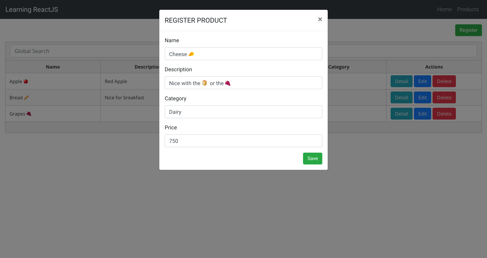
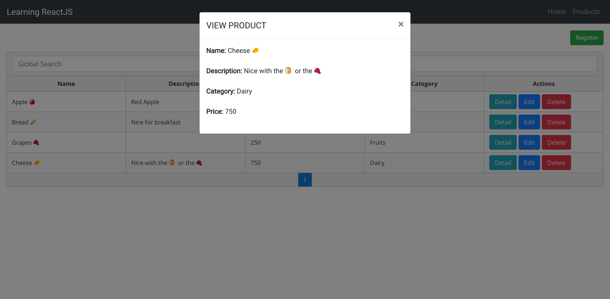

# ⏳ Realtime Products CRUD 🍎🥖

It's a simple CRUD application using React as Frontend and NodeJS with Sockets as Backend.

The database used in this sample is MongoDB and it just has one Schema.

```javascript
Product = new Schema({
    name: String,
    description: String,
    price: Number,
    category: String
});
```
The purpose of this application is just learn how to use some modules of each technology such as:

**React:**
- React-Router-Dom, 
- Reactstrap, 
- PrimeReact, 
- Redux, React-Redux

**NodeJS**
- Express
- Mongoose
- Socket.IO (Used to update all the clients when someone add/edit a Product)

## Example image




